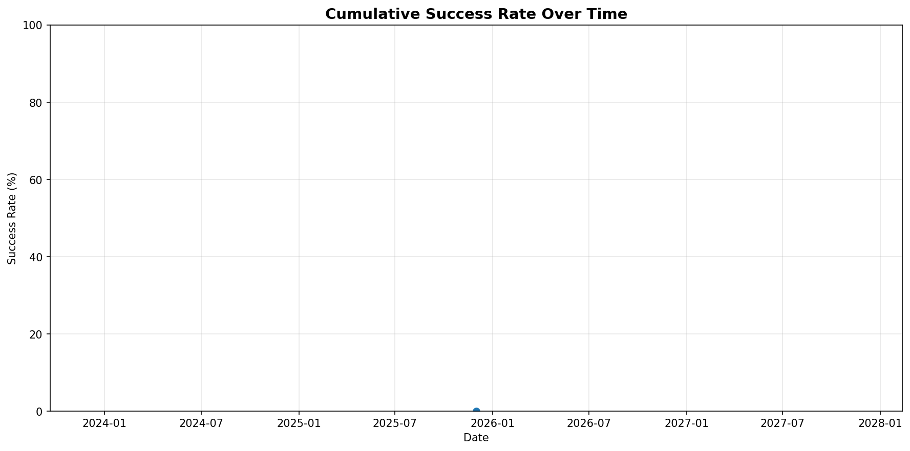
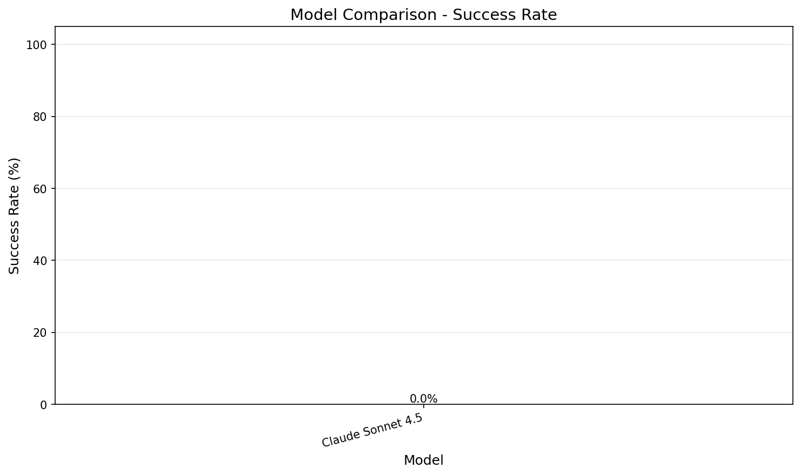
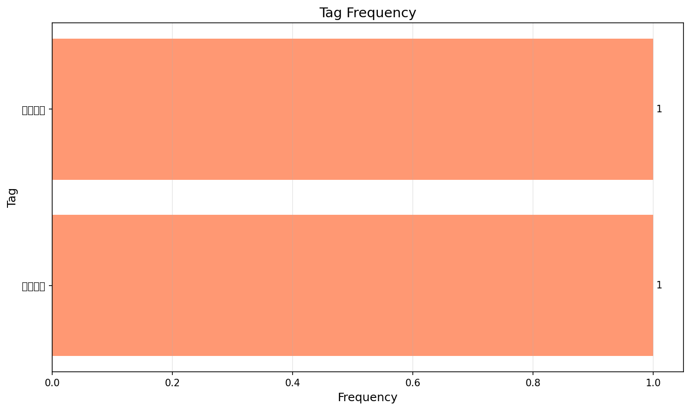

# 統計・分析

[← トップへ](./Home)

最終更新: 2025-12-01

---

## サマリー

- **総実験数:** 2
- **今週の実験数:** 2
- **成功率 (○以上):** 100.0%

## 評価別内訳

| 評価 | 件数 | 割合 |
|------|------|------|
| ◎ 期待以上 | 0 | 0.0% |
| ○ 期待通り | 2 | 100.0% |
| △ 期待以下 | 0 | 0.0% |
| ❌ 失敗 | 0 | 0.0% |

## モデル別統計

| モデル | 実験数 | ◎ | ○ | △ | ❌ | 成功率 |
|--------|--------|---|---|---|---|--------|
| Claude Sonnet 4.5 | 1 | 0 | 1 | 0 | 0 | 100.0% |
| Gemini 2.5 Pro | 1 | 0 | 1 | 0 | 0 | 100.0% |

## タグ別統計

| タグ | 出現回数 | 関連実験 |
|------|----------|----------|
| 長文読解 | 1 | [001](./001) |
| レビュー | 1 | [001](./001) |
| 短編 | 1 | [2](./2) |
| Gemini 2.5 Pro | 1 | [2](./2) |

---

## グラフ

### 評価推移

### モデル別比較

### タグクラウド

---

**自動生成:** このページは `scripts/update_stats.py` により自動更新されます。
